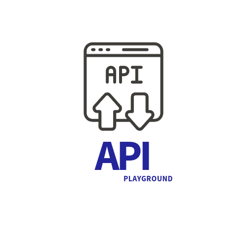
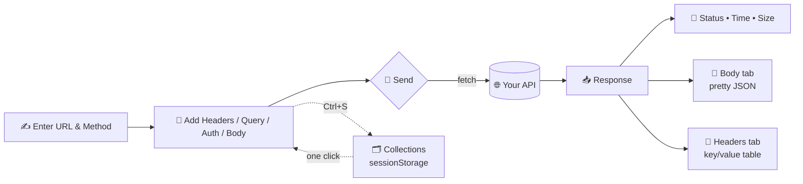

<div align="center">



# API Tester

**A lightweight REST API client & tester in one HTML file — a simple Postman alternative.**

No install. No build. No dependencies. Open it, test your API, done.

   

</div>

---

## 🔍 Why this exists

Sometimes you just want to hit an endpoint and see what comes back — without signing into a heavy desktop app. API Tester is the whole client packed into a single `index.html`: methods, headers, query params, auth, and a Postman-style response viewer.

## ✨ Features

- All HTTP methods — GET, POST, PUT, DELETE, PATCH, HEAD, OPTIONS
- Headers & query params with live two-way URL sync
- Auth built in: Bearer, Basic, API Key, OAuth 2.0
- Response viewer with status color, time, size, and Body / Headers tabs
- Auto pretty-printed JSON
- Save requests as collections in the sidebar (session-only, tokens never persist)
- Resizable panels + light/dark theme
- Shortcuts: `Ctrl + Enter` to send, `Ctrl + S` to save

## 🧭 How it works



## 🚀 Quick start

```bash
git clone https://github.com/manoj-maharana/api-tester.git
cd api-tester
```

Open `index.html` in any modern browser, paste an endpoint like
`https://jsonplaceholder.typicode.com/posts/1`, and press **Send**.

## 🌍 Deploy

It's one static file — host it anywhere:

- **GitHub Pages** → Settings → Pages → source: `main` / root
- **Netlify / Vercel** → drop the folder, no build command
- **Any server** → copy `index.html`, done

> **Note on CORS:** requests use the browser's `fetch`, so the target API must allow browser origins. Public APIs like JSONPlaceholder work out of the box.

## 📁 Structure

```
api-tester/
├── index.html   # the entire app
├── logo.png
└── README.md
```

## 👤 Author

**Manoj Maharana** — [github.com/manoj-maharana](https://github.com/manoj-maharana)

⭐ If this saved you a download, a star is appreciated!

## 📄 License

MIT
